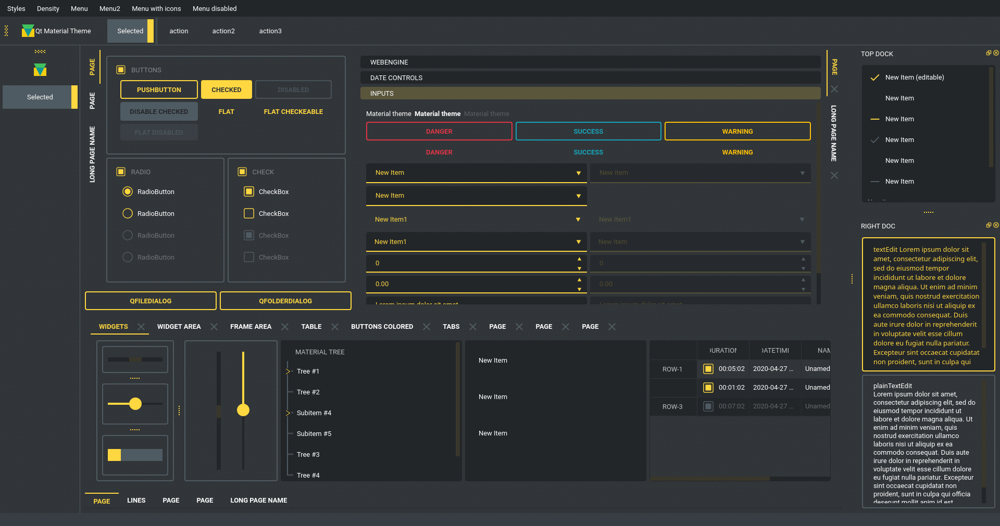
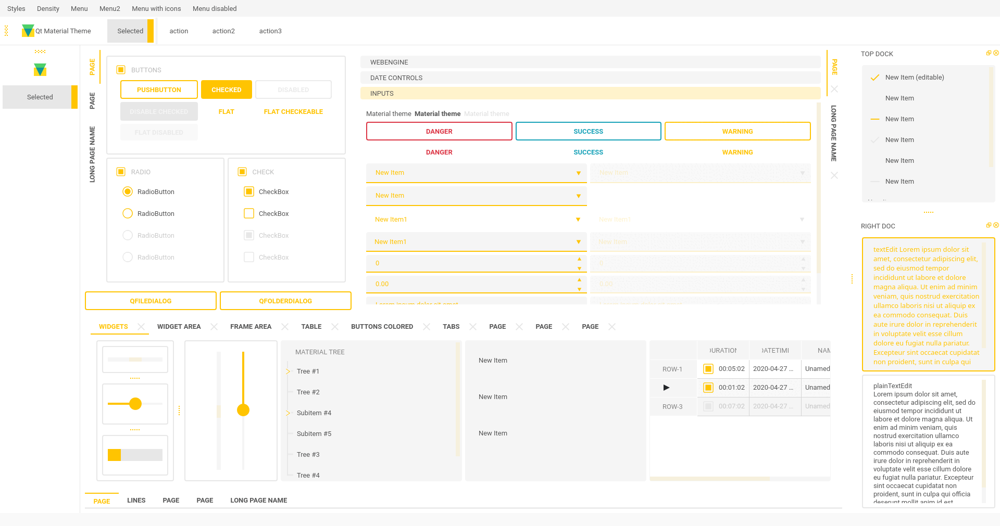
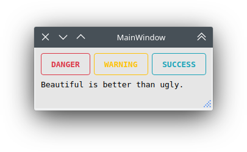
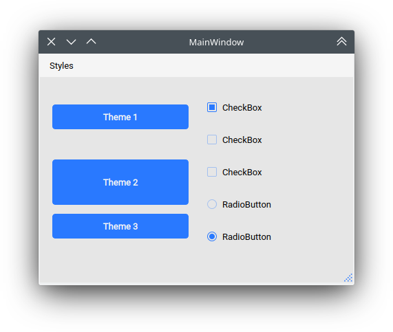
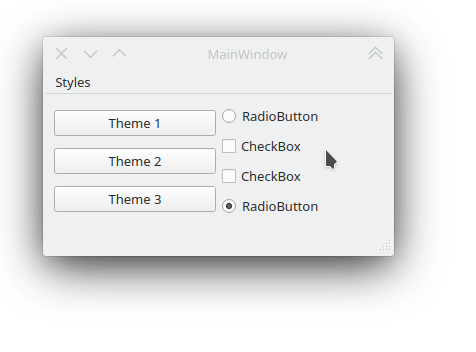
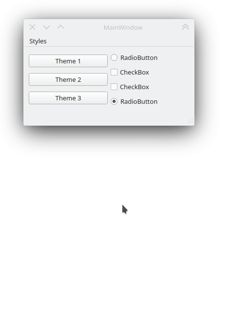
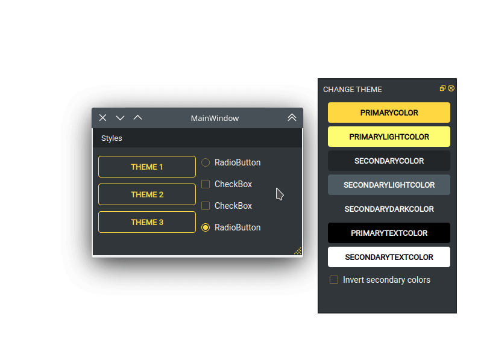
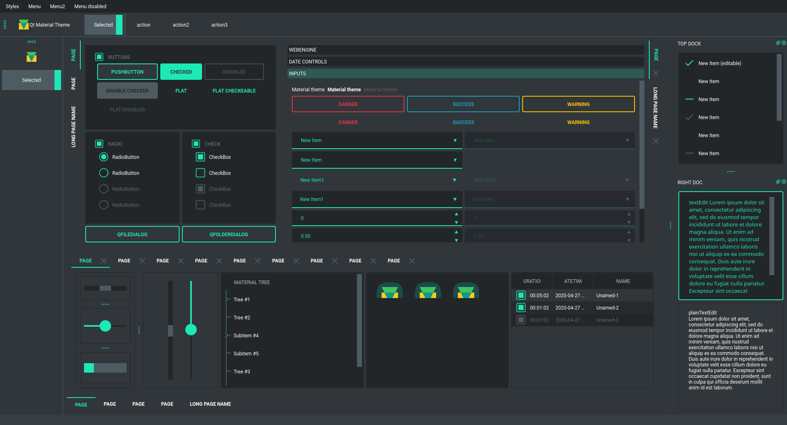

Qt-Material
===========

This is another stylesheet for **PySide6**, **PySide2** and **PyQt5**,
which looks like Material Design (close enough).

|GitHub top language| |PyPI - License| |PyPI| |PyPI - Status| |PyPI -
Python Version| |GitHub last commit| |CodeFactor Grade| |Documentation
Status|

.. |GitHub top language| image:: https://img.shields.io/github/languages/top/un-gcpds/qt-material
.. |PyPI - License| image:: https://img.shields.io/pypi/l/qt-material
.. |PyPI| image:: https://img.shields.io/pypi/v/qt-material
.. |PyPI - Status| image:: https://img.shields.io/pypi/status/qt-material
.. |PyPI - Python Version| image:: https://img.shields.io/pypi/pyversions/qt-material
.. |GitHub last commit| image:: https://img.shields.io/github/last-commit/un-gcpds/qt-material
.. |CodeFactor Grade| image:: https://img.shields.io/codefactor/grade/github/UN-GCPDS/qt-material
.. |Documentation Status| image:: https://readthedocs.org/projects/qt-material/badge/?version=latest
   :target: https://qt-material.readthedocs.io/en/latest/?badge=latest

There is some custom dark themes: |dark| And light: |light|

Navigation
----------

-  `Install <#install>`__
-  `Usage <#usage>`__
-  `Themes <#themes>`__
-  `Custom colors <#custom-colors>`__
-  `Usage <#usage>`__
-  `Light themes <#light-themes>`__
-  `Environ variables <#environ-variables>`__
-  `Alternative QPushButtons and custom
   fonts <#alternative-qpushbuttons-and-custom-fonts>`__
-  `Custom stylesheets <#custom-stylesheets>`__
-  `Run examples <#run-examples>`__
-  `New themes <#new-themes>`__
-  `Change theme in runtime <#change-theme-in-runtime>`__
-  `Export theme <#export-theme>`__
-  `Density scale <#density-scale>`__

Install
-------

.. code:: ipython3

    pip install qt-material

Usage
-----

.. code:: ipython3

    import sys
    from PySide6 import QtWidgets
    # from PySide2 import QtWidgets
    # from PyQt5 import QtWidgets
    from qt_material import apply_stylesheet
    
    # create the application and the main window
    app = QtWidgets.QApplication(sys.argv)
    window = QtWidgets.QMainWindow()
    
    # setup stylesheet
    apply_stylesheet(app, theme='dark_teal.xml')
    
    # run
    window.show()
    app.exec_()

Themes
------

.. code:: ipython3

    from qt_material import list_themes
    
    list_themes()

.. parsed-literal::

    WARNING:root:qt_material must be imported after PySide or PyQt!

.. parsed-literal::

    ['dark_amber.xml',
     'dark_blue.xml',
     'dark_cyan.xml',
     'dark_lightgreen.xml',
     'dark_pink.xml',
     'dark_purple.xml',
     'dark_red.xml',
     'dark_teal.xml',
     'dark_yellow.xml',
     'light_amber.xml',
     'light_blue.xml',
     'light_cyan.xml',
     'light_cyan_500.xml',
     'light_lightgreen.xml',
     'light_pink.xml',
     'light_purple.xml',
     'light_red.xml',
     'light_teal.xml',
     'light_yellow.xml']

Custom colors
-------------

`Color Tool <https://material.io/resources/color/>`__ is the best way to
generate new themes, just choose colors and export as ``Android XML``,
the theme file must look like:

.. code:: ipython3

    <!--?xml version="1.0" encoding="UTF-8"?-->
    <resources>
    <color name="primaryColor">#00e5ff</color>
    <color name="primaryLightColor">#6effff</color>
    <color name="secondaryColor">#f5f5f5</color>
    <color name="secondaryLightColor">#ffffff</color>
    <color name="secondaryDarkColor">#e6e6e6</color>
    <color name="primaryTextColor">#000000</color>
    <color name="secondaryTextColor">#000000</color>
    </resources>

Save it as ``my_theme.xml`` or similar and apply the style sheet from
Python.

.. code:: ipython3

    apply_stylesheet(app, theme='dark_teal.xml')

Light themes
------------

Light themes will need to add ``invert_secondary`` argument as ``True``.

.. code:: ipython3

    apply_stylesheet(app, theme='light_red.xml', invert_secondary=True)

Environ variables
-----------------

There is a environ variables related to the current theme used, these
variables are for **consult purpose only**.

+------------------------+--------------------------------+-----------+
| Environ variable       | Description                    | Example   |
+========================+================================+===========+
| Q                      | Primary color                  | #2979ff   |
| TMATERIAL_PRIMARYCOLOR |                                |           |
+------------------------+--------------------------------+-----------+
| QTMATE                 | A bright version of the        | #75a7ff   |
| RIAL_PRIMARYLIGHTCOLOR | primary color                  |           |
+------------------------+--------------------------------+-----------+
| QTM                    | Secondary color                | #f5f5f5   |
| ATERIAL_SECONDARYCOLOR |                                |           |
+------------------------+--------------------------------+-----------+
| QTMATERI               | A bright version of the        | #ffffff   |
| AL_SECONDARYLIGHTCOLOR | secondary color                |           |
+------------------------+--------------------------------+-----------+
| QTMATER                | A dark version of the primary  | #e6e6e6   |
| IAL_SECONDARYDARKCOLOR | color                          |           |
+------------------------+--------------------------------+-----------+
| QTMAT                  | Color for text over primary    | #000000   |
| ERIAL_PRIMARYTEXTCOLOR | background                     |           |
+------------------------+--------------------------------+-----------+
| QTMATER                | Color for text over secondary  | #000000   |
| IAL_SECONDARYTEXTCOLOR | background                     |           |
+------------------------+--------------------------------+-----------+
| QTMATERIAL_THEME       | Name of theme used             | light     |
|                        |                                | _blue.xml |
+------------------------+--------------------------------+-----------+

Alternative QPushButtons and custom fonts
-----------------------------------------

There is an ``extra`` argument for accent colors and custom fonts.

.. code:: ipython3

    extra = {
    
        # Button colors
        'danger': '#dc3545',
        'warning': '#ffc107',
        'success': '#17a2b8',
    
        # Font
        'font_family': 'Roboto',
    }
    
    apply_stylesheet(app, 'light_cyan.xml', invert_secondary=True, extra=extra)

The accent colors are applied to ``QPushButton`` with the corresponding
``class`` property:

.. code:: ipython3

    pushButton_danger.setProperty('class', 'danger')
    pushButton_warning.setProperty('class', 'warning')
    pushButton_success.setProperty('class', 'success')

   extra

Custom stylesheets
------------------

Custom changes can be performed by overwriting the stylesheets, for
example:

.. code:: ipython3

    QPushButton {{
      color: {QTMATERIAL_SECONDARYCOLOR};
      text-transform: none;
      background-color: {QTMATERIAL_PRIMARYCOLOR};
    }}
    
    .big_button {{
      height: 64px;
    }}

Then, the current stylesheet can be extended just with:

.. code:: ipython3

    apply_stylesheet(app, theme='light_blue.xml')
    
    stylesheet = app.styleSheet()
    with open('custom.css') as file:
        app.setStyleSheet(stylesheet + file.read().format(**os.environ))

And the class style can be applied with the ``setProperty`` method:

.. code:: ipython3

    self.main.pushButton.setProperty('class', 'big_button')

   extra

Run examples
------------

A window with almost all widgets (see the previous screenshots) are
available to test all themes and **create new ones**.

.. code:: ipython3

    git clone https://github.com/UN-GCPDS/qt-material.git
    cd qt-material
    python setup.py install
    cd examples/full_features
    python main.py --pyside6

.. figure:: _images/theme.gif
   :alt: theme

   theme

New themes
----------

Do you have a custom theme? it looks good? create a `pull
request <https://github.com/UN-GCPDS/qt-material/pulls>`__ in `themes
folder <https://github.com/UN-GCPDS/qt-material/tree/master/qt_material/themes%3E>`__
and share it with all users.

Change theme in runtime
-----------------------

There is a ``qt_material.QtStyleTools`` class that must be inherited
along to ``QMainWindow`` for change themes in runtime using the
``apply_stylesheet()`` method.

.. code:: ipython3

    class RuntimeStylesheets(QMainWindow, QtStyleTools):
        
        def __init__(self):
            super().__init__()
            self.main = QUiLoader().load('main_window.ui', self)
            
            self.apply_stylesheet(self.main, 'dark_teal.xml')
            # self.apply_stylesheet(self.main, 'light_red.xml')
            # self.apply_stylesheet(self.main, 'light_blue.xml')

   run

Integrate stylesheets in a menu
~~~~~~~~~~~~~~~~~~~~~~~~~~~~~~~

A custom *stylesheets menu* can be added to a project for switching
across all default available themes.

.. code:: ipython3

    class RuntimeStylesheets(QMainWindow, QtStyleTools):
        
        def __init__(self):
            super().__init__()
            self.main = QUiLoader().load('main_window.ui', self)
            
            self.add_menu_theme(self.main, self.main.menuStyles)

   menu

Create new themes
-----------------

A simple interface is available to modify a theme in runtime, this
feature can be used to create a new theme, the theme file is created in
the main directory as ``my_theme.xml``

.. code:: ipython3

    class RuntimeStylesheets(QMainWindow, QtStyleTools):
        
        def __init__(self):
            super().__init__()
            self.main = QUiLoader().load('main_window.ui', self)
            
            self.show_dock_theme(self.main)

   dock

A full set of examples are available in the `exmaples
directory <https://github.com/UN-GCPDS/qt-material/blob/master/examples/runtime/>`__

Export theme
------------

This feature able to use ``qt-material`` themes into ``Qt``
implementations using only local files.

.. code:: ipython3

    from qt_material import export_theme
    
    extra = {
    
        # Button colors
        'danger': '#dc3545',
        'warning': '#ffc107',
        'success': '#17a2b8',
    
        # Font
        'font_family': 'monoespace',
        'font_size': '13px',
        'line_height': '13px',
    
        # Density Scale
        'density_scale': '0',
    
        # environ
        'pyside6': True,
        'linux': True,
    
    }
    
    export_theme(theme='dark_teal.xml', 
                 qss='dark_teal.qss', 
                 rcc='resources.rcc',
                 output='theme', 
                 prefix='icon:/', 
                 invert_secondary=False, 
                 extra=extra,
                )

This script will generate both ``dark_teal.qss`` and ``resources.rcc``
and a folder with all theme icons called ``theme``.

The files generated can be integrated into a ``PySide6`` application
just with:

.. code:: ipython3

    import sys
    
    from PySide6 import QtWidgets
    from PySide6.QtCore import QDir
    from __feature__ import snake_case, true_property
    
    # Create application
    app = QtWidgets.QApplication(sys.argv)
    
    # Load styles
    with open('dark_teal.qss', 'r') as file:
        app.style_sheet = file.read()
    
    # Load icons
    QDir.add_search_path('icon', 'theme')
    
    # App
    window = QtWidgets.QMainWindow()
    checkbox = QtWidgets.QCheckBox(window)
    checkbox.text = 'CheckBox'
    window.show()
    app.exec()

This files can also be used into non ``Python`` environs like ``C++``.

Density scale
-------------

The ``extra`` arguments also include an option to set the **density
scale**, by default is ``0``.

.. code:: ipython3

    extra = {
        
        # Density Scale
        'density_scale': '-2',
    }
    
    apply_stylesheet(app, 'default', invert_secondary=False, extra=extra)

   dock
